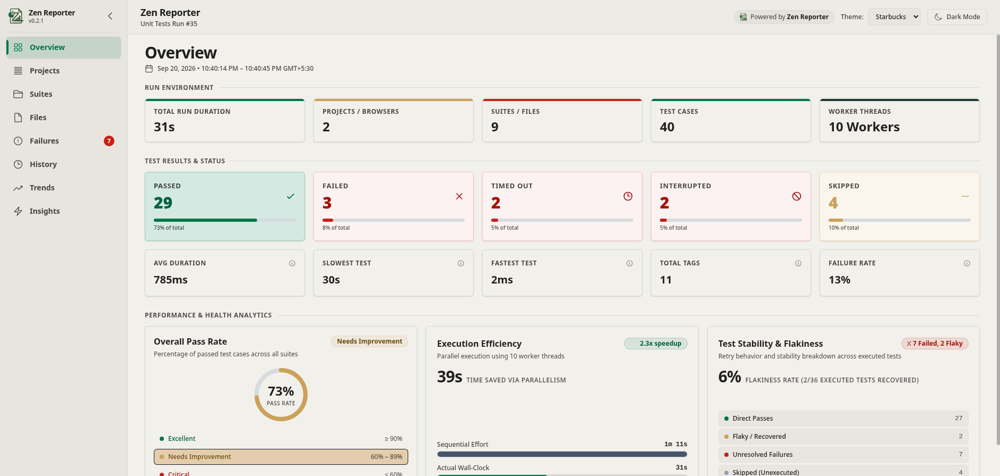
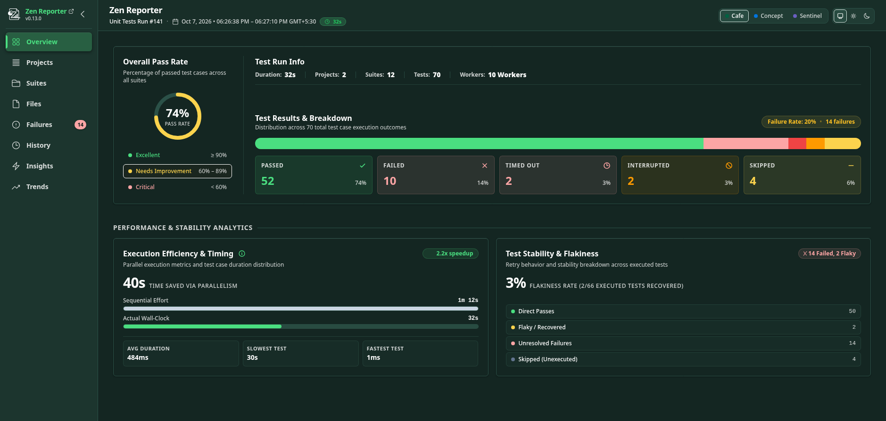

# Zen Reporter

[](LICENSE)

Beautiful test execution reports for Playwright.

Zen Reporter transforms Playwright's raw test results into an interactive, visually stunning dashboard. It provides a clean, modern interface for exploring test suites, analyzing pass/fail rates, and diving into individual test failures with full step-by-step execution traces, source code snippets, syntax highlighting, and error stacks.

Light mode:



Dark mode:



## Features

- **High-Level Test Dashboard**: Visual summary metrics featuring pass rate radial indicators, execution efficiency, health breakdowns, run environment details (duration, projects, suites, test counts, worker threads), and calculation tooltips.
- **Per-Project Execution Analytics**: Detailed status bar charts, volume and coverage distribution, and project detail cards comparing Playwright project profiles.
- **Suite & Spec File Explorer**: Interactive, searchable tree view container for nested `describe` suites with collapsible nodes, bulk expand/collapse controls, retry badges, test case cards, and paginated spec file summary tables.
- **Deep-Dive Failure Analysis**: Detailed root cause analysis with two grouping modes (file grouping and error signature clustering to group identical root causes into Shared Issue clusters), step-by-step execution traces with target indicators (`▶`), source code snippets with syntax highlighting, diff stack traces (`Expected` vs `Received`), and retry attempt tabs (`Run`, `Retry #1`).
- **Visual Regression Diff Viewer**: Built-in side-by-side snapshot comparison for visual regression testing, allowing interactive comparison of `actual`, `expected` (baseline), and overlay `diff` image attachments.
- **Execution History Archiving**: Archive historical test runs with details on run metadata, execution modes (`Parallel, N workers` vs `Serial`), wall-clock duration, pass/fail ratios, and automated quality ratings (`Excellent`, `Needs improvement`, `Critical`).
- **File & Test Case History**: Dedicated **File History** and **Test History** views to analyze long-term spec file stability, individual test case pass/fail rates, run counts, average execution durations, date-range filtering, and text search across historical runs.
- **Export to CSV**: Lightweight, RFC 4180-compliant UTF-8 CSV exporter for all report tables (Files, History, Insights). Respects active filters/date ranges and exports un-paginated full datasets for easy data sharing and external analysis.
- **Visual Quality Trends**: Track pass rate percentages over time, multi-project execution duration trends per project profile, and step category trends across historical runs.
- **DuckDB-Powered Test Intelligence**: Embedded analytics engine for advanced test suite intelligence:
  - **Flaky Intelligence**: Detect tests fluctuating between pass and fail across historical runs.
  - **Regression Tracking**: Identify tests that previously passed but regressed to failed in the latest run.
  - **Slowest Tests Analysis**: Rank top slowest test cases by average execution duration across runs.
  - **P95 Duration & Latency**: Analyze 95th percentile completion thresholds per project profile.
- **Core Platform Capabilities**:
  - **Themes & Dark Mode**: Multiple design themes (`Cafe`, `Concept`, `Sentinel`) with light and dark mode toggles, built with WCAG-compliant color tokens and configurable default states.
  - **Single-File Standalone Output**: Generates a self-contained single-file HTML report (`index.html`) with embedded datasets for easy sharing and CI/CD artifact storage. Optionally creates a lightweight standalone `summary.html` dedicated to executive dashboards.

> **Note**: Designed and built with AI pair-programming tools; fully tested, maintained, and quality-assured by human hands.

---

> **Compatibility**: Zen Reporter is designed for standard Playwright test suites and does not support BDD-styled tests (e.g. Cucumber / `playwright-bdd`).

## Installation

```bash
npm install @arpanp/zen-reporter
```

---

## Configuring Zen Reporter in Playwright

Add `zen-reporter` to your `playwright.config.ts` (or `playwright.config.js`):

### Basic Configuration

```ts
import { defineConfig } from '@playwright/test';

export default defineConfig({
  reporter: 'zen-reporter',
});
```

### Advanced Configuration (With Options)

You can pass configuration options using the tuple syntax in Playwright:

```ts
import { defineConfig } from '@playwright/test';

export default defineConfig({
  reporter: [
    [
      'zen-reporter',
      {
        outputDir: 'zen-report', // Optional: Output directory where report files will be generated (default: "zen-report")
        projectName: 'My E2E Project', // Optional: Project name displayed in the top bar header
        testRunName: 'Nightly Build #42', // Optional: Test run / build name displayed in the top bar header
        theme: 'Cafe', // Optional: Theme applied on initial load ("Cafe" | "Concept" | "Sentinel", default: "Cafe")
        darkMode: false, // Optional: Initial dark mode state (default: false)
        singleSummaryFile: true, // Optional: Generates a standalone summary.html file alongside index.html
        minimalReport: false, // Optional: Produces a lightweight, basic report (disables history, hides analytical charts & secondary tabs, default: false)
        enableHistory: 'auto', // Optional: History recording mode ("auto" | boolean, default: "auto")
        consoleProgress: 'auto', // Optional: Console execution progress output ("auto" | "line" | "dot" | false, default: "auto")
      },
    ],
  ],
});
```

### Options Reference

| Option              | Type                                   | Default                     | Description                                                                                                                                 |
| :------------------ | :------------------------------------- | :-------------------------- | :------------------------------------------------------------------------------------------------------------------------------------------ |
| `outputDir`         | `string`                               | `"zen-report"`              | Directory where final report files are saved.                                                                                               |
| `projectName`       | `string`                               | `"Test Automation Project"` | Project name displayed prominently in the top bar of the dashboard.                                                                         |
| `testRunName`       | `string`                               | `"Test Run #{N}"`           | Test run or build name displayed in top bar. `{N}` is replaced dynamically by run number.                                                   |
| `theme`             | `string`                               | `"Cafe"`                    | Theme applied on first load (`"Cafe"`, `"Concept"`, `"Sentinel"`).                                                                          |
| `darkMode`          | `boolean`                              | `false`                     | When set to `true`, the report loads in dark mode on first load.                                                                            |
| `singleSummaryFile` | `boolean`                              | `false`                     | Generates a standalone `summary.html` for executive summary views.                                                                          |
| `minimalReport`     | `boolean`                              | `false`                     | When `true`, disables history recording and hides analytical charts/secondary tabs (Projects, History, Trends, Insights) for a lean report. |
| `enableHistory`     | `'auto' \| boolean`                    | `"auto"`                    | Controls history execution archiving (`"auto"`, `true`, `false`). Forced to `false` when `minimalReport` is `true`.                         |
| `consoleProgress`   | `'auto' \| 'line' \| 'dot' \| boolean` | `"auto"`                    | Controls terminal execution output (`"auto"` selects `line` in TTY and `dot` in non-TTY).                                                   |

---

## Usage

### 1. Running Tests

Run your Playwright tests as usual. Zen Reporter will stream live progress directly to your console (`line` mode in interactive terminals or `dot` mode in non-TTY environments) and display summary table upon test completion, while building structured suite trees and generating the standalone HTML report:

```bash
npx playwright test
```

### 2. Viewing the Generated Report

Launch the built-in report server to open the interactive dashboard in your browser using `npx zr show`:

```bash
npx zr show
```

### 3. CLI Commands Reference (`zr`)

Zen Reporter includes a built-in CLI executable (`npx zr`) for serving reports, checking system environment, and querying historical test execution data:

#### Report & Environment

- **`npx zr show`** — Launch the report server to view `index.html` in your default browser.
- **`npx zr summary`** — Output Markdown summary snippet for current run results (ideal for PR comments or Slack).
- **`npx zr env`** — Print environment details (`zen-reporter` version, `@playwright/test` version, Node.js version, OS).

#### History & Intelligence (`zr history`)

> **Note**: History commands analyze stored JSONL run logs via DuckDB. Ensure `@duckdb/node-api` is installed in your project (`npm i -D @duckdb/node-api`).

| Command                           | Description                                                                                        |
| :-------------------------------- | :------------------------------------------------------------------------------------------------- |
| `npx zr history`                  | List all historical test runs with start time, duration, and pass/fail/skip counts.                |
| `npx zr history runs`             | Same as above. List all historical test runs with start time, duration, and pass/fail/skip counts. |
| `npx zr history files`            | Summarize historical test execution metrics grouped by spec file.                                  |
| `npx zr history tests`            | Summarize granular historical execution metrics and average durations per test case.               |
| `npx zr history flaky`            | Identify flaky tests that passed in some runs and failed in others.                                |
| `npx zr history regressions`      | List tests that passed in a previous run but failed in the latest run.                             |
| `npx zr history slow [--limit N]` | Rank the top `N` slowest tests by average execution duration across runs (default: 10).            |
| `npx zr history trend`            | Display historical pass rate percentages per run over time.                                        |
| `npx zr history report`           | Build `history.json` and inject it into `index.html` to populate the History & Trends tabs.        |
| `npx zr history query "<SQL>"`    | Run arbitrary DuckDB SQL queries over recorded test runs.                                          |
