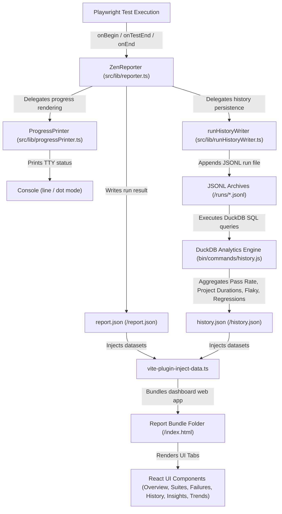

# Project Structure & Architecture

```text
zen-reporter/
├── src/
├── components/
│   ├── dashboard/             # Dashboard / Overview tab components
│   │   ├── ExecutionEfficiencyCard.tsx
│   │   ├── Overview.tsx       # Main Overview layout
│   │   ├── PassRateRing.tsx   # Radial pass rate chart (using theme tokens)
│   │   ├── QuickStats.tsx     # KPI stat counters
│   │   ├── RunInfoCard.tsx    # Run metadata cards
│   │   ├── SummaryCard.tsx    # High-level summary metrics
│   │   └── TestHealthCard.tsx # Test health breakdown
│   ├── failures/              # Failures tab components
│   │   ├── FailureList.tsx    # Failure lists with trace & error details
│   │   └── FailuresSection.tsx# Failure view with search & grouping
│   ├── files/                 # Spec Files tab components
│   │   ├── FileMetricsSection.tsx
│   │   ├── FileSummary.tsx
│   │   └── FilesSection.tsx
│   ├── history/               # History tab components & sub-sections
│   │   ├── HistoryFileSection.tsx        # Spec files execution history breakdown
│   │   ├── HistoryGuides.tsx             # Interactive guide modals for History tab
│   │   ├── HistoryRunsTableSection.tsx   # Test runs audit log table
│   │   ├── HistorySection.tsx            # Main History tab container
│   │   └── HistoryTestSection.tsx        # Individual test case history breakdown
│   ├── insights/              # Insights tab components
│   │   ├── InsightsGuides.tsx # Guide modal for Insights tab
│   │   ├── InsightsSection.tsx
│   │   ├── ProjectDurationChart.tsx
│   │   └── ProjectFlakyRateChart.tsx
│   ├── layout/                # Layout & navigation components
│   │   └── Sidebar.tsx        # Navigation sidebar layout component
│   ├── pagination/            # Centralized pagination components & hooks
│   │   ├── PageSizeControl.tsx
│   │   ├── PaginationFooter.tsx
│   │   └── usePagination.ts
│   ├── projects/              # Projects tab components
│   │   ├── ProjectBarCharts.tsx
│   │   ├── ProjectDetailCards.tsx
│   │   ├── ProjectVolumeCoverageChart.tsx
│   │   ├── ProjectsGuides.tsx  # Guide modal for Projects tab
│   │   ├── ProjectsOverviewCards.tsx
│   │   └── ProjectsSection.tsx
│   ├── shared/                # Shared cross-tab components
│   │   ├── test-case-detail/  # Decomposed Test Case Detail modal sub-components
│   │   │   ├── AttemptTabSelector.tsx # Multi-attempt retry selection tab bar
│   │   │   ├── AttemptView.ts         # Attempt normalization & attachment helpers
│   │   │   ├── StepItem.tsx           # Step execution tree row & accordion
│   │   │   ├── TestAttachments.tsx    # Attachment grid & preview modal
│   │   │   ├── TestErrorAlert.tsx     # Failure details & stack trace alert box
│   │   │   └── TestStdOutput.tsx      # Console stdout/stderr output blocks
│   │   ├── DataTable.tsx      # Reusable styled data table component
│   │   ├── DateFilterControl.tsx # Date-range filter selector control
│   │   ├── GuideModal.tsx     # Reusable modal for feature documentation
│   │   ├── HistoryDisabledBanner.tsx # Alert banner shown when history recording is disabled
│   │   ├── LearnMoreButton.tsx
│   │   ├── MultiSelectFilter.tsx
│   │   ├── SearchInput.tsx    # Shared real-time text search filter input component
│   │   ├── StatCard.tsx
│   │   ├── TagCloudModal.tsx  # Searchable tag cloud & multi-select modal dialog
│   │   ├── TestCaseCard.tsx
│   │   └── TestCaseDetail.tsx # Lightweight modal container
│   ├── suites/                # Suites tab tree view components
│   │   ├── SuiteView.tsx      # Tree view container for test suites
│   │   ├── SuitesSection.tsx  # Suites tab container
│   │   └── TestSuiteNode.tsx  # Collapsible suite node
│   ├── trends/                # Quality & duration trends tab
│   │   ├── step-category/     # Step category trend sub-components
│   │   │   ├── StepCategoryChart.tsx        # Recharts stacked bar chart
│   │   │   ├── stepCategoryClassifier.ts    # Title classification & category counter
│   │   │   └── StepCategorySummaryCards.tsx # Ratio KPI summary cards
│   │   ├── DurationTrend.tsx
│   │   ├── PassRateTrend.tsx
│   │   ├── StepCategoryTrend.tsx
│   │   ├── TrendTick.tsx      # Consolidated SVG trend tick renderer & timestamp parser
│   │   ├── TrendsGuides.tsx   # Guide modal for Trends tab
│   │   └── TrendsSection.tsx
│   └── visual-regression/     # Visual regression diff viewer components
│       ├── DiffHighlightViewer.tsx # Overlay & difference highlight viewer
│       ├── ImageSliderViewer.tsx   # Interactive split-screen slider viewer
│       ├── SideBySideViewer.tsx    # Side-by-side snapshot comparison view
│       ├── ViewModeSelector.tsx    # Toggle controls for diff comparison modes
│       └── VisualDiffViewer.tsx    # Main visual diff modal / container component
├── lib/
│   ├── types/                 # Modular domain type definitions
│   │   ├── history.ts         # DuckDB historical analytics & JSONL row schemas
│   │   └── report.ts          # Core Playwright execution report models (TestCase, ResultSummary, etc.)
│   ├── codeHighlighting.ts    # Syntax highlighting for step code snippets & error stack traces
│   ├── cryptoUtils.ts         # MD5/SHA-256 hashing & error signature clustering
│   ├── dataProcessor.ts       # Raw data conversion, duration calculations & package manager detection
│   ├── exportToCsv.ts         # Zero-dependency RFC 4180 CSV exporter with UTF-8 BOM
│   ├── formatters.ts          # Duration, timestamp, text & file path formatting helpers
│   ├── progressPrinter.ts     # Dedicated TTY console progress rendering ('line' | 'dot' | 'none')
│   ├── reporter.ts            # Playwright reporter lifecycle event orchestrator (onBegin, onTestEnd, onEnd)
│   ├── runHistory.ts          # Run identifier builder & DuckDB row flattening utilities
│   ├── runHistoryWriter.ts    # Self-contained per-run JSONL persistence helper under <outputDir>/runs/
│   ├── statsUtils.ts          # Single-pass O(N) project stats calculator & executive KPI generator
│   ├── tagColors.ts           # Deterministic HSL color generator for tags
│   └── theme.ts               # Unified UI theme tokens, brand color maps & status color palettes
├── App.tsx                    # Root component with theme/darkMode initial loading, version title header & tab routing
├── app.css                    # Design system CSS with theme palettes (Cafe, Concept, Sentinel), WCAG contrast tokens & dark mode styles
├── main.tsx                   # React application entry point
├── vite-env.d.ts              # Vite type declarations
└── vite-plugin-inject-data.ts # Vite plugin to inline report.json & history.json into HTML
├── bin/                       # Modularized CLI commands
│   ├── commands/              # Sub-command handlers
│   │   ├── common.js          # Shared CLI helpers & DuckDB history query loader
│   │   ├── env.js             # System environment diagnostics handler ('zr env')
│   │   ├── help.js            # Help and usage documentation renderer
│   │   ├── history.js         # History report and query engine handler ('zr history ...')
│   │   ├── show.js            # Internal 127.0.0.1 static HTTP report server launcher ('zr show')
│   │   └── summary.js         # Markdown summary snippet generator ('zr summary')
│   └── zen-reporter.js        # Executable CLI entry point delegating to bin/commands/
├── zen-report/                # Generated self-contained report bundle folder
│   ├── index.html             # Main interactive HTML dashboard interface
│   ├── summary.html           # Optional executive summary HTML (when singleSummaryFile: true)
│   ├── runs/                  # Historical per-run JSONL execution archives
│   ├── report.json            # Processed test execution JSON dataset
│   ├── history.json           # Historical test analytics & DuckDB trend dataset
│   └── attachments/           # Copied test assets (screenshots, videos, trace files)
├── tests/                     # Playwright test files
├── playwright.config.ts       # Playwright test configuration with retries & dynamic testRunName
├── vite.config.ts             # Vite single-file bundling configuration
└── package.json
```

---

## Data Flow & Architecture Diagram



```text
               Playwright Test Execution
                         │
                         ▼
        ZenReporter (src/lib/reporter.ts)
  Hooks: onBegin ➔ onTestBegin ➔ onTestEnd ➔ onEnd
  Orchestrates Playwright lifecycle events:
    ├── TTY Progress ──► ProgressPrinter (src/lib/progressPrinter.ts)
    └── History Writer ──► runHistoryWriter (src/lib/runHistoryWriter.ts)
                         │
                         ▼
             <outputDir>/report.json
    Structured JSON dataset containing testRun & summary
                         │
                         ▼
       Report Pipeline (scripts/generate_report.js)
  Processes raw test data (src/lib/dataProcessor.ts)
  Triggers Vite compilation (npx vite build)
                         │
                         ▼
    Vite Data Injector (src/vite-plugin-inject-data.ts)
  Inlines report.json into <script id="report-data"> tag in HTML
                         │
                         ▼
         <outputDir>/index.html (Report Dashboard)
  Interactive React web application rendering test suites & analytics
                         │
                         ▼
         CLI Report Server (npx zr show)
  Launches local web server to display index.html in default browser
```
