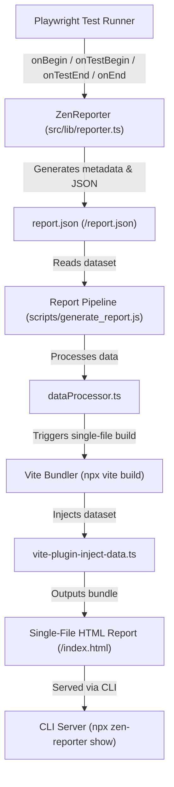

# Project Structure

```text
zen-reporter/
├── src/
│   ├── components/
│   │   ├── dashboard/
│   │   │   ├── FileSummary.tsx        # File breakdown table with status counts (including Interrupted)
│   │   │   ├── Overview.tsx           # Dashboard layout, wall-clock timing & high-level stats
│   │   │   ├── PassRateRing.tsx       # Radial pass rate indicator
│   │   │   ├── ProjectBarCharts.tsx   # Per-project test status bar charts with stacked interrupted bars
│   │   │   ├── QuickStats.tsx         # KPI summary counters with calculation tooltips
│   │   │   ├── RunInfoCard.tsx        # Reusable metric tile for Run Info Bar metrics
│   │   │   └── SummaryCard.tsx        # Reusable metric card with icons & contrast borders
│   │   ├── failures/
│   │   │   ├── FailureList.tsx        # List view for failed, timed-out & interrupted tests
│   │   │   └── FailuresSection.tsx    # Failures tab container with search, filters & Interrupted KPI
│   │   └── suites/
│   │       ├── MultiSelectFilter.tsx  # Multi-select dropdown filter component
│   │       ├── SuiteView.tsx          # Tree view container for test suites
│   │       ├── SuitesSection.tsx       # Suites tab container with search & expand all
│   │       ├── TestCaseCard.tsx       # Individual test case card with retry badge (N Retries)
│   │       ├── TestCaseDetail.tsx     # Attempt tabs (Run, Retry #N), highlighted stack traces, & attachment modal
│   │       └── TestSuiteNode.tsx      # Collapsible suite node for nested describes
│   ├── lib/
│   │   ├── dataProcessor.ts         # Raw data conversion, wall-clock calculation & package manager detector
│   │   ├── reporter.ts              # Playwright Reporter implementation with interrupted status & wall-clock timing
│   │   ├── tagColors.ts             # Deterministic HSL color generator for tags
│   │   ├── types.ts                 # TypeScript interfaces for report data models (with 'interrupted' status & workers)
│   │   └── utils.ts                 # Suite tree builders, fastest/slowest calculators & ANSI cleaner
│   ├── App.tsx                      # Root component with tab routing & filter state
│   ├── app.css                      # Design system CSS, WCAG contrast tokens & dark mode styles
│   ├── main.tsx                     # React application entry point
│   ├── vite-env.d.ts                # Vite type declarations
│   └── vite-plugin-inject-data.ts   # Vite plugin to inline report.json into HTML
├── bin/
│   └── zen-reporter.js              # CLI executable (npx zen-reporter show)
├── scripts/
│   └── generate_report.js           # Standalone HTML build script (Node ES module)
├── zen-report/
│   ├── index.html                   # Generated standalone single-file HTML report
│   ├── summary.html                 # Optional standalone summary HTML (Overview dashboard only)
│   ├── report.json                  # Processed test execution JSON data
│   └── attachments/                 # Copied test assets (screenshots, videos, traces)
├── tests/                           # Playwright test files (failures, retry, interrupted, annotations)
├── playwright.config.ts             # Playwright test configuration
├── vite.config.ts                   # Vite single-file bundling configuration
└── package.json
```

---

## Data Flow



```text
               Playwright Test Execution
                         │
                         ▼
        ZenReporter (src/lib/reporter.ts)
  Hooks: onBegin ➔ onTestBegin ➔ onTestEnd ➔ onEnd
  Captures test metadata, describe hierarchy, retry attempts,
  interrupted states (SIGKILL/crash), wall-clock duration & worker counts
                         │
                         ▼
              <outputDir>/report.json
    Structured JSON dataset containing testRun & summary
                         │
                         ▼
      Report Pipeline (scripts/generate_report.ts)
  Processes raw test data (src/lib/dataProcessor.ts)
  Triggers Vite single-file compilation (npx vite build)
                         │
                         ▼
    Vite Data Injector (src/vite-plugin-inject-data.ts)
  Inlines report.json into <script id="report-data"> tag in HTML
                         │
                         ▼
        <outputDir>/index.html (Single-File Report)
  Fully self-contained interactive React web application
                         │
                         ▼
        CLI Report Server (npx zen-reporter show)
  Launches Playwright web server to serve the report locally
```
