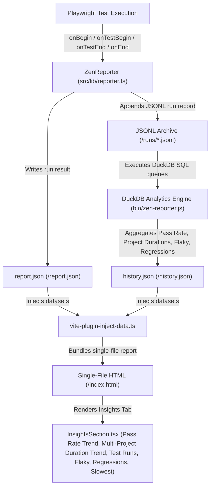

# Project Structure

```text
zen-reporter/
├── src/
│   ├── components/
│   │   ├── dashboard/             # Dashboard / Overview tab components
│   │   │   ├── ExecutionEfficiencyCard.tsx
│   │   │   ├── Overview.tsx       # Main Overview layout
│   │   │   ├── PassRateRing.tsx   # Radial pass rate chart
│   │   │   ├── QuickStats.tsx     # KPI stat counters
│   │   │   ├── RunInfoCard.tsx    # Run metadata cards
│   │   │   ├── SummaryCard.tsx    # High-level summary metrics
│   │   │   └── TestHealthCard.tsx # Test health breakdown
│   │   ├── failures/              # Failures tab components
│   │   │   ├── FailureList.tsx    # Failure lists with trace & error details
│   │   │   └── FailuresSection.tsx# Failure view with search & grouping
│   │   ├── files/                 # Spec Files tab components
│   │   │   ├── FileMetricsSection.tsx
│   │   │   ├── FileSummary.tsx
│   │   │   └── FilesSection.tsx
│   │   ├── history/               # History tab components
│   │   │   ├── HistoryGuides.tsx  # Guide modal for History tab
│   │   │   └── HistorySection.tsx # Historical run execution, File History & Test History views
│   │   ├── insights/              # Insights tab components
│   │   │   ├── InsightsGuides.tsx # Guide modal for Insights tab
│   │   │   ├── InsightsSection.tsx
│   │   │   ├── ProjectDurationChart.tsx
│   │   │   └── ProjectFlakyRateChart.tsx
│   │   ├── layout/                # Layout & navigation components
│   │   │   └── Sidebar.tsx        # Navigation sidebar layout component
│   │   ├── pagination/            # Centralized pagination components & hooks
│   │   │   ├── PageSizeControl.tsx
│   │   │   ├── PaginationFooter.tsx
│   │   │   ├── index.ts
│   │   │   └── usePagination.ts
│   │   ├── projects/              # Projects tab components
│   │   │   ├── ProjectBarCharts.tsx
│   │   │   ├── ProjectDetailCards.tsx
│   │   │   ├── ProjectVolumeCoverageChart.tsx
│   │   │   ├── ProjectsGuides.tsx  # Guide modal for Projects tab
│   │   │   ├── ProjectsOverviewCards.tsx
│   │   │   └── ProjectsSection.tsx
│   │   ├── shared/                # Shared cross-tab components
│   │   │   ├── DataTable.tsx      # Reusable styled data table component
│   │   │   ├── DateFilterControl.tsx # Date-range filter selector control
│   │   │   ├── GuideModal.tsx     # Reusable modal for feature documentation
│   │   │   ├── HistoryDisabledBanner.tsx # Alert banner shown when history recording is disabled
│   │   │   ├── LearnMoreButton.tsx
│   │   │   ├── MultiSelectFilter.tsx
│   │   │   ├── SearchInput.tsx    # Shared real-time text search filter input component
│   │   │   ├── StatCard.tsx
│   │   │   ├── TagCloudModal.tsx  # Searchable tag cloud & multi-select modal dialog
│   │   │   ├── TestCaseCard.tsx
│   │   │   ├── TestCaseDetail.tsx
│   │   │   └── index.ts
│   │   ├── suites/                # Suites tab tree view components
│   │   │   ├── SuiteView.tsx      # Tree view container for test suites
│   │   │   ├── SuitesSection.tsx  # Suites tab container
│   │   │   └── TestSuiteNode.tsx  # Collapsible suite node
│   │   ├── trends/                # Quality & duration trends tab
│   │   │   ├── DurationTrend.tsx
│   │   │   ├── PassRateTrend.tsx
│   │   │   ├── StepCategoryTrend.tsx
│   │   │   ├── TrendsGuides.tsx   # Guide modal for Trends tab
│   │   │   └── TrendsSection.tsx
│   │   └── visual-regression/     # Visual regression diff viewer components
│   │       ├── DiffHighlightViewer.tsx # Overlay & difference highlight viewer
│   │       ├── ImageSliderViewer.tsx   # Interactive split-screen slider viewer
│   │       ├── SideBySideViewer.tsx    # Side-by-side snapshot comparison view
│   │       ├── ViewModeSelector.tsx    # Toggle controls for diff comparison modes
│   │       └── VisualDiffViewer.tsx    # Main visual diff modal / container component
│   ├── lib/
│   │   ├── dataProcessor.ts         # Raw data conversion, wall-clock calculation & package manager detector
│   │   ├── exportToCsv.ts           # Zero-dependency RFC 4180 CSV export utility with UTF-8 BOM
│   │   ├── reporter.ts              # Playwright Reporter implementation (theme/darkMode resolution & auto history refresh)
│   │   ├── runHistory.ts            # JSONL run execution logger & history archiver
│   │   ├── tagColors.ts             # Deterministic HSL color generator for tags
│   │   ├── types.ts                 # TypeScript interfaces (ReportData, TestRun, ReporterConfig, HistoryRun, etc.)
│   │   └── utils.ts                 # Suite tree builders, fastest/slowest calculators, ANSI cleaner & visual diff extractor (`extractVisualDiffPairs`)
│   ├── App.tsx                      # Root component with theme/darkMode initial loading, version title header & tab routing
│   ├── app.css                      # Design system CSS with theme palettes (Cafe, Concept, Sentinel), WCAG contrast tokens & dark mode styles
│   ├── main.tsx                     # React application entry point
│   ├── vite-env.d.ts                # Vite type declarations
│   └── vite-plugin-inject-data.ts   # Vite plugin to inline report.json & history.json into HTML
├── bin/
│   └── zen-reporter.js              # CLI executable & DuckDB history aggregation engine (history report/runs/files/tests/flaky/regressions/slow)
├── zen-report/
│   ├── index.html                   # Standalone single-file HTML report
│   ├── history.json                 # Historical test analytics & trend data
│   ├── runs/                        # Historical run JSONL execution archives
│   ├── summary.html                 # Standalone summary HTML (Overview dashboard only)
│   ├── report.json                  # Processed test execution JSON data
│   └── attachments/                 # Copied test assets (screenshots, videos, traces)
├── tests/                           # Playwright test files
│   └── visual-regression.spec.ts    # Visual regression snapshot test suites
├── playwright.config.ts             # Playwright test configuration with retries & dynamic testRunName
├── vite.config.ts                   # Vite single-file bundling configuration
└── package.json
```

---

## Data Flow & Insights Analytics Engine



```text
               Playwright Test Execution
                         │
                         ▼
        ZenReporter (src/lib/reporter.ts)
  Hooks: onBegin ➔ onTestBegin ➔ onTestEnd ➔ onEnd
  Captures test metadata, describe hierarchy, retry attempts,
  interrupted states (SIGKILL/crash), wall-clock duration & worker counts
                         │
                         ▼
              <outputDir>/report.json
    Structured JSON dataset containing testRun & summary
                         │
                         ▼
      Report Pipeline (scripts/generate_report.ts)
  Processes raw test data (src/lib/dataProcessor.ts)
  Triggers Vite single-file compilation (npx vite build)
                         │
                         ▼
    Vite Data Injector (src/vite-plugin-inject-data.ts)
  Inlines report.json into <script id="report-data"> tag in HTML
                         │
                         ▼
        <outputDir>/index.html (Single-File Report)
  Fully self-contained interactive React web application
                         │
                         ▼
        CLI Report Server (npx zr show)
  Launches Playwright web server to serve the report locally
```
